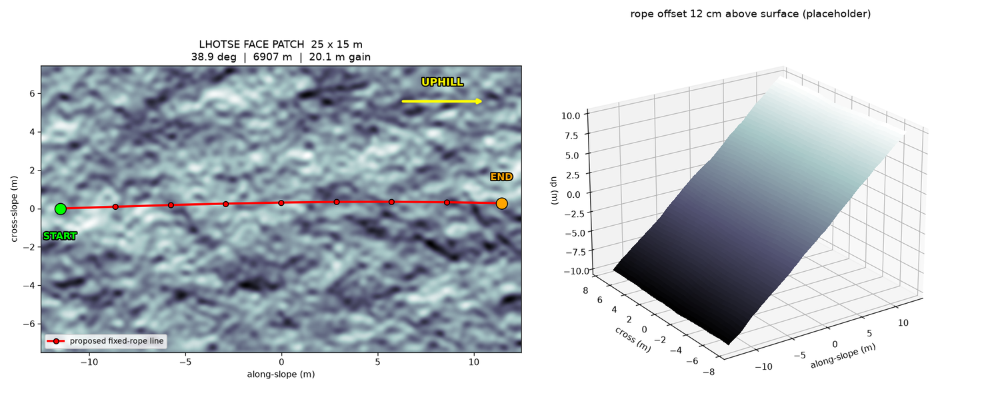

# Lhotse Face — Camp II to Camp III

**MuJoCo** environment (unlike `himalaya_3m/`, which is Isaac Sim / USD).

A 25 × 15 m patch of the **Everest South Col route**, between Camp II and
Camp III, for the fixed-rope / ascender task. Real geographic location and
macro slope; synthetic sub-30 m detail (there is no other option — see below).


## Where it is

|  |  |
|---|---|
| position | Lhotse Face, **90 % of the way** from Camp 2S to Camp 3S |
| coordinates | 27.97016 N, 86.91594 E |
| altitude | **6907 m** (507 m above Camp 2S, 193 m below Camp 3S) |
| distance | 2078 m from Camp 2S, 231 m from Camp 3S |
| mean slope | **38.9°** (neighbourhood 35.5–47.6°) |
| downhill aspect | 292° WNW, into the Western Cwm |
| patch | 25 × 15 m, 20.14 m vertical gain, 5 cm sampling |


## Training patch set

Nine patches in **two classes that are not equivalent evidence**. The split is
in the directory structure on purpose.

### `patches/real/` — location AND slope measured from the DEM

Four points along the real Lhotse Face, spread across the steep band between
Camp II and Camp III:

| patch | altitude | slope | aspect | lat, lon |
|---|---:|---:|---:|---|
| `A` | 6788 m | 33.5° | 288° | 27.97121, 86.91439 |
| `B` | 6879 m | **38.8°** | 292° | 27.97047, 86.91548 |
| `C` | 6982 m | 36.4° | 295° | 27.96973, 86.91657 |
| `D` | 7082 m | 35.7° | 297° | 27.96900, 86.91765 |

These are terrain observations. The slope figures are what the DEM says the
Lhotse Face does there.

### `patches/curriculum/` — location real, **slope overridden**

Patch B's location with the incline forced to a chosen angle, for curriculum /
domain randomisation:

| patch | applied | vs real (38.8°) |
|---|---:|---:|
| `B_slope25` | 25° | −13.8° |
| `B_slope30` | 30° | −8.8° |
| `B_slope35` | 35° | −3.8° |
| `B_slope45` | 45° | +6.2° |
| `B_slope50` | 50° | +11.2° |

**These are training aids, not measurements.** The Lhotse Face is not 50° at
that location. Do not label a curriculum patch as "the Lhotse Face at N
degrees" in a writeup or demo — say the slope was set for training. Every
curriculum `.json` carries a `WARNING` field saying so, and the loader prints
`SYNTHETIC OVERRIDE` at startup.

### What is synthetic in *both* classes

**All detail finer than ~30 m.** GLO-30 cells here are 27.3 × 30.7 m, so a
25 × 15 m patch is **0.36 of one cell**. No public sub-metre Everest terrain
exists. Roughness is seeded correlated noise (2.0 / 0.6 / 0.2 m octaves,
0.120 m RMS) and shifts the planar slope by about +0.2°.

So per patch: `location_is_real: true` always; `slope_is_real` true for
`real/`, false for `curriculum/`; sub-30 m detail synthetic everywhere.

### Using them

```bash
python mujoco_scene.py --list             # every patch, with its class
python mujoco_scene.py --patch A          # a real one
python mujoco_scene.py --patch B_slope45  # a curriculum one
python build_patch_set.py                 # regenerate (needs fetch_data.py first)
```

## Quick start

```bash
cd assets/environments/lhotse_face
python mujoco_scene.py                    # viewer
python mujoco_scene.py --headless         # physics check, no window
python mujoco_scene.py --rope-height 0.6  # rope standoff (default 0.6 m)
python export_obj.py                      # rebuild the OBJ (also shipped)
```

The mesh is shipped here as `lhotse_face_B.obj` (9.9 MB) for Blender and
renderers. `export_obj.py` rebuilds it identically from the heightfield.

The terrain is a **`hfield`, not a mesh geom**. MuJoCo replaces mesh geoms with
their convex hull for collision, which would turn a 38.9° slope into a solid
wedge — looking correct in the viewer while colliding wrongly. `hfield` collides
against the actual per-cell triangles.

Elevation is pushed in as float32 via `model.hfield_data` rather than a PNG: an
8-bit PNG quantises this patch's 20.5 m span into 8 cm steps, coarser than the
12 cm RMS roughness itself. **`lhotse_face.xml` alone is not enough** —
it is written for inspection but carries no elevation data; run the module.

## Data sources

| what | source | licence |
|---|---|---|
| terrain | Copernicus GLO-30 DEM, tile N27 E086 (1 arcsec) | ESA, free |
| route | OpenStreetMap nodes (Camps 1S–4S, Everest, Lhotse) | ODbL |

Camps as mapped in OSM:

| camp | ele | lat | lon |
|---|---:|---:|---:|
| Camp 1S | 6060 | 27.98642 | 86.87652 |
| Camp 2S | 6400 | 27.98156 | 86.89914 |
| Camp 3S | 7100 | 27.96889 | 86.91781 |
| Camp 4S (South Col) | 7920 | 27.97337 | 86.93025 |

## Registration accuracy: **Level 2**

Real georeferenced DEM + real OSM coordinates — *not* a recorded GPS track.
No public GPX of the South Col route was found.

Validation, DEM sampled at the OSM coordinates: Camp 2S **−8 m**, Camp 3S
**−23 m**, Camp 1S **−18 m**.

Two checks that fell out of the data rather than being assumed:

- the C2→C3 profile is **flat then steep** — 8–16° for the first 70 % (Western
  Cwm), crossing 25° at 6762 m and reaching 42° (Lhotse Face). Matches the
  published 30–45°.
- the patch's downhill aspect is **292° WNW** — the Lhotse Face does face
  northwest into the Cwm.

So: confidently on the Lhotse Face, right altitude, right slope, on the straight
C2→C3 line. **Not** verifiably the exact line climbers take, which weaves with
the fixed ropes and moves between seasons.

## REAL vs SYNTHETIC — read this before quoting the terrain

**Copernicus GLO-30 cells here are 27.3 × 30.7 m. A 25 × 15 m patch is 0.36 of
one cell.** There is no public sub-metre terrain data for Everest, and the
Sketchfab mesh people reach for has 20–37 m triangles — the same order.

| | |
|---|---|
| **REAL** | location, altitude, 38.91° macro slope (plane fit over 246 × 276 m, 5.24 m RMS residual), 292.3° aspect |
| **SYNTHETIC** | everything finer than ~30 m: correlated noise at 2.0 / 0.6 / 0.2 m octaves, 0.120 m RMS, seed 20260829 |

Conservative by construction: adding the roughness moves the planar slope from
38.91° to 39.08°, **+0.17°**.



## Rope route

`lhotse_face_B.json → rope_route_xyz` — 9 waypoints raycast onto the surface,
23.0 m run, +18.42 m gain. Rendered at a configurable standoff (default 0.6 m).
Currently visual only (`contype=0 conaffinity=0`); **rope physics is not
implemented**.

## Regenerating from scratch

`pipeline/` holds the full chain. Fetch the source raster first:

```bash
python fetch_data.py     # 41 MB Copernicus tile, free, no auth
```

**No Git LFS, no Drive.** The only file that could not live in plain git is a
203 MB DEM from a different project (GitHub rejects >100 MB); nothing here
needs it. LFS would spend the repo owner's quota and force every clone through
`git-lfs`, for a raster that is one public URL away. Scripts:

```
everest_route.py     OSM route + DEM validation
lhotse_face.py       Lhotse Face extraction, views A & B
lhotse_patches.py    candidate selection + resolution check
build_lhotse_patch.py  final patch, OBJ, metadata, rope waypoints
crop_mesh_ladder.py  Sketchfab mesh crops (see below)
fbx_convert.py       Blender FBX -> PLY (needs Blender)
```

## On the Sketchfab Everest mesh

A commonly used asset ([Sketchfab, CC-BY](https://sketchfab.com/3d-models/mount-everest-1f49c7f095f1434c82963ea60ae6a774))
has **no georeferencing metadata** and its highest ground is clipped at the tile
edge, so it cannot be registered. Cropping it, via `crop_mesh_ladder.py`:

```
4000 m ->  84,639 tris    1000 m -> 5,214 tris    250 m -> 332 tris
 100 m ->      45 tris      25 m ->     4 tris   <- our patch size
```

It is good for a **visual backdrop at 250–1000 m** and useless at robot scale.


## Known gotchas

- `rasterio.windows.from_bounds` returns a **fractional** window and clips at the
  raster edge, while `window_transform()` keeps the requested origin. A window
  overhanging the tile's north edge came back shifted 53 rows — Camp 1S read
  7406 m instead of 6060 m. Always `.intersection(Window(0,0,ds.width,ds.height))`.
- `~T * (lon, lat)` puts integers on pixel **corners**. Floor, never round; one
  pixel is hundreds of metres of elevation on this face.
- Blender's OBJ importer defaults to `up_axis='Y'` and will silently rotate these
  Z-up meshes. Import with `forward_axis='Y', up_axis='Z'`.
- Blender's camera `clip_end` defaults to 100 m; the 1000 m crops render as empty
  sky until you raise it.
